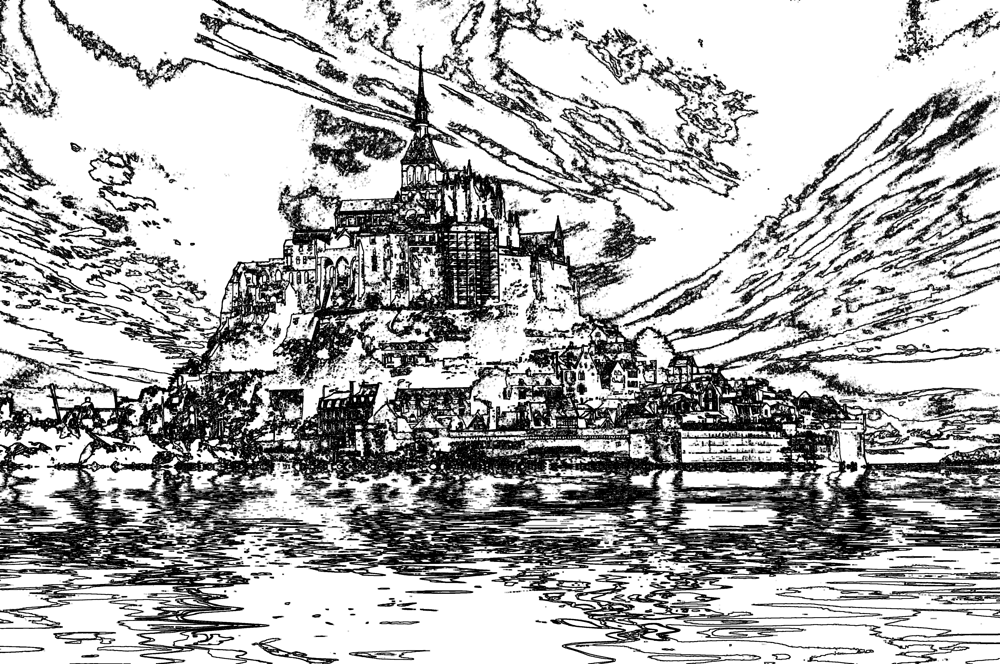
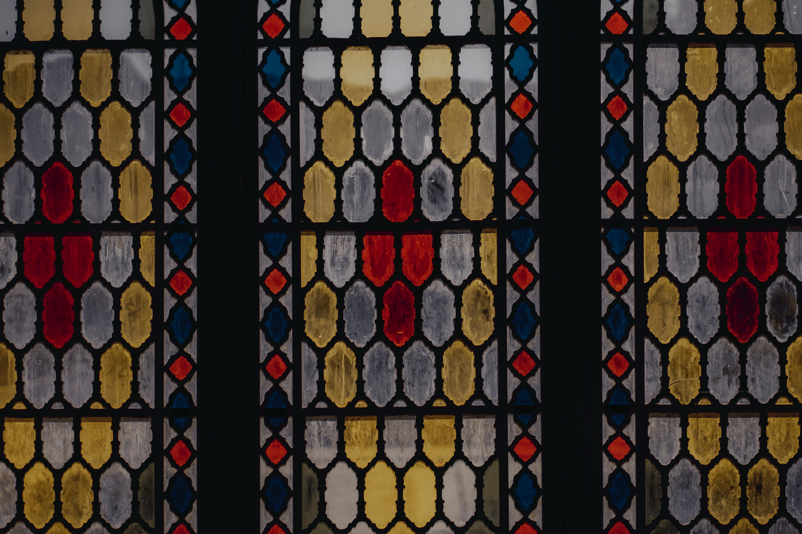
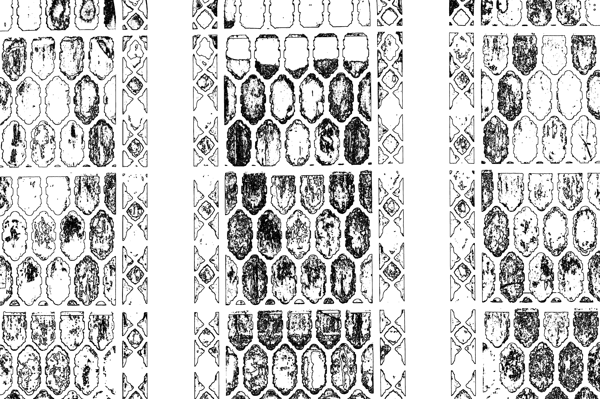

# paint-by-numbers-generator
the goal of the project is to generate a random "paint by numbers" image by using a free image API and my own rudimentary form of edge-detection. It can currently create line art for a given image, the next step is to display a marking within each section indicating what color it should be

## examples

